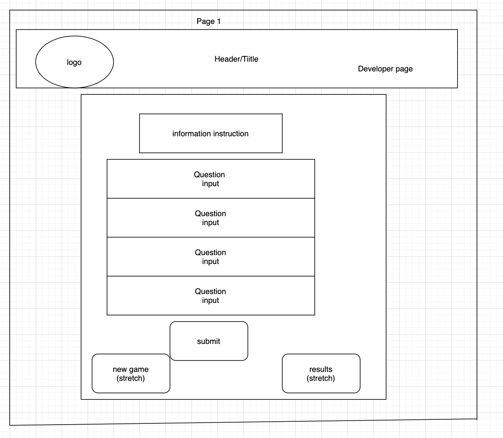
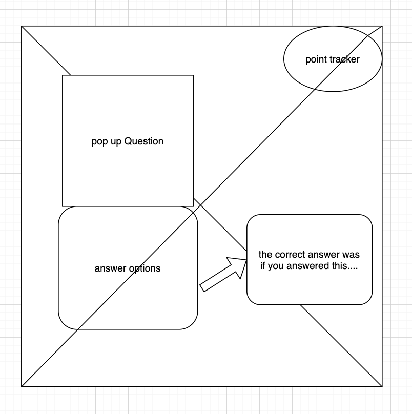
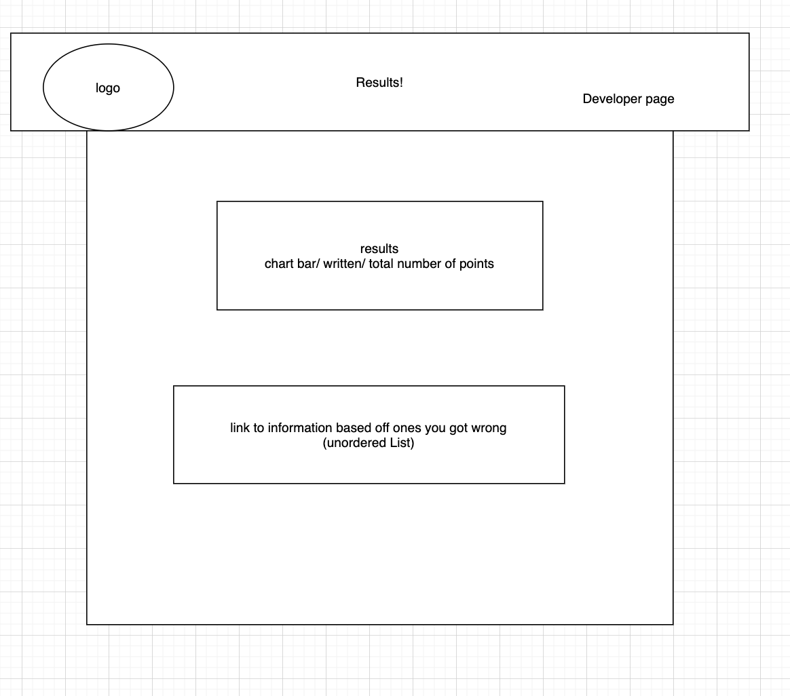
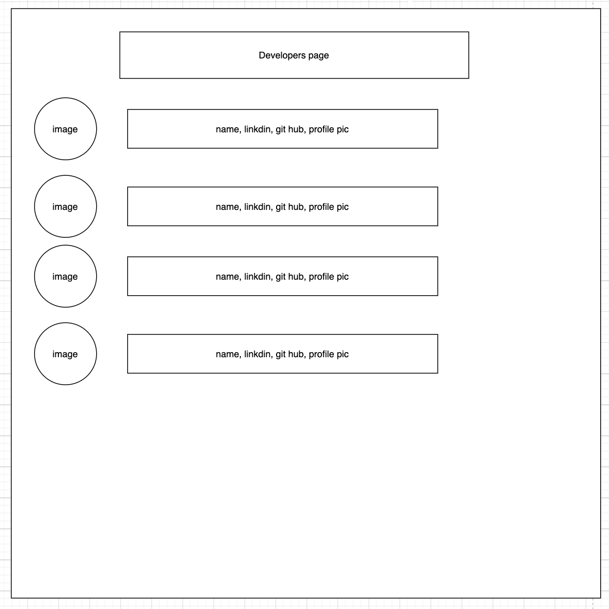
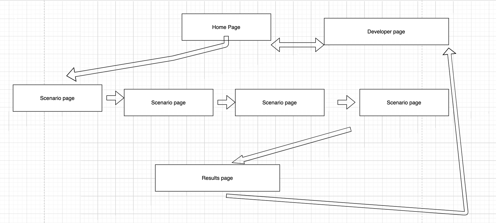

# Corona-Challenge
201 class project

Create an engaging, educational app to educate the public about exposure risk to coronavirus.

## Authors: 
Claudio Bailon-Schubert
Courtney Hans
Tia Low
David Quinn

## Wireframe

## DOM

## Links and Resources
[GitHub Project Plan link](https://github.com/Team-Daphne/Corona-Challenge/projects/1?fullscreen=true)

## Reflections and Comments

## Licenses
MIT License