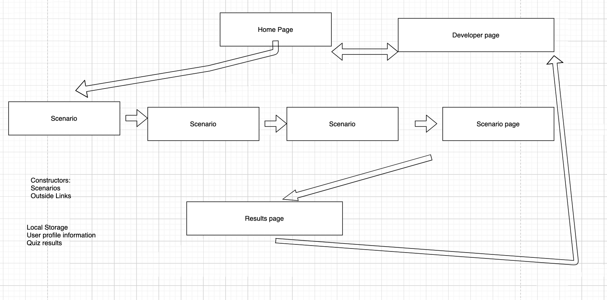

# Corona-Challenge
201 class project

Create an engaging, educational app to educate the public about exposure risk to coronavirus. Users are invited to share some personal information, then take a quiz that will help tailor recommendations and additional resources. 

Local storage will remember if a user has visited before, and the quiz moves through a short list of scenarios, prompting an answer. After each question, and answer key is displayed (low risk to high risk choice) and points tallied. After completing the quiz, the user will move to a results page displaying total score, as well as links that populate dependant upon both final score and expressed areas of interest. An About Us page introduces the development team.

Constructors: scenario(questions), outside links, user profile image

Local storage utilized to save user preferences as well as render total score to results page.

JavaScript used to make a dynamic scenario page that would refresh questions, answers, and background images with event listeners on submit and next question buttons, logic ensures a "see results button" displays when end of quiz is reached.

## Authors: 
Claudio Bailon-Schubert
Courtney Hans
Tia Low
David Quinn

## Wireframe

## DOM

## Links and Resources
[GitHub Project Plan link](https://github.com/Team-Daphne/Corona-Challenge/projects/1?fullscreen=true)

## Reflections and Comments

Spending the time as a group to make some big decisions, ensure consensus and understanding, and build team rapport was critical to our success!

## Licenses
MIT License